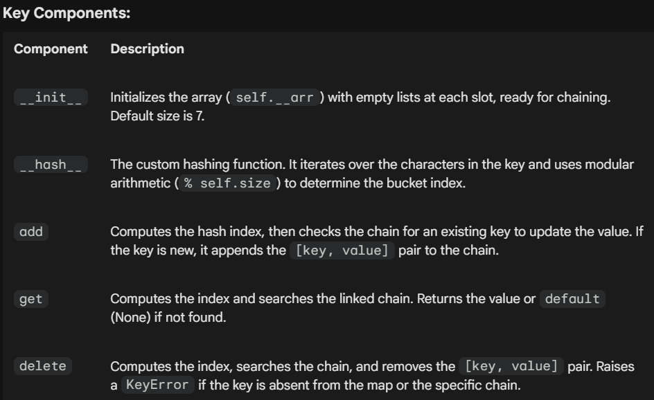
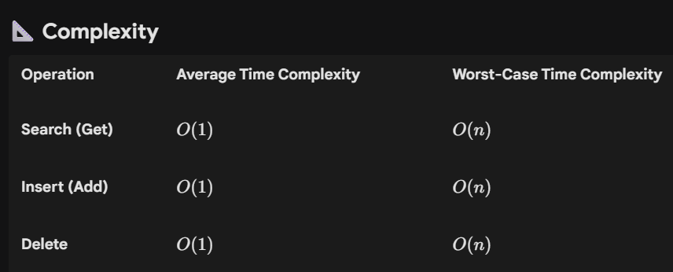

# 🔗 Custom Hash Map (Separate Chaining)

This script implements a custom HashMap `Hash Table` class from scratch in Python. It demonstrates the core principles of hash tables, including indexing, key-value storage, and a robust strategy for collision resolution using Separate Chaining.

# 🚀 How to Run

1. Run the script:
```bash 
  python main.py
```

2. The if __name__ == '__main__': block demonstrates basic usage:

- Adding and updating values for key 1.

- Adding a value for key 2.

- Retrieving values for existing keys.

- Attempting to delete a non-existent key (3), which triggers a custom error message.

# 💡 Implementation Details

The custom HashMap is built using a Python list (the main array) where each slot can hold another list, implementing the chaining approach.




Note: The worst-case $O(n)$ occurs when the hash function is poor, resulting in all keys mapping to the same bucket (a single long chain).