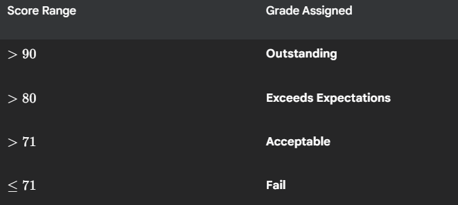

## 📊 Score to Grade Processor

This script processes a dictionary of student scores and automatically assigns a qualitative grade to each student based on predefined scoring thresholds. It demonstrates basic dictionary iteration and conditional logic (if/elif/else) for categorization.

## 🚀 How to Run

Run the script:
```bash
    python main.py
```

The program immediately processes the hardcoded student_scores dictionary and prints the final student_grades dictionary to the console, showing each student's name and their corresponding grade.

## 💡 Grading Logic

The program uses the following thresholds to assign a grade to each student's score:



The script iterates through the student_scores dictionary, checks the score against the thresholds in descending order, and populates the new student_grades dictionary with the results.