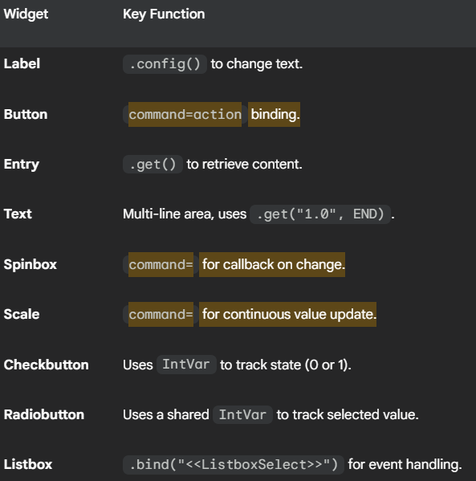

## 🖼️ Tkinter All Widgets Demo

This Python script uses the built-in Tkinter library to create a single window that showcases the configuration and functionality of various standard Graphical User Interface (GUI) widgets.  This is an excellent reference for learning how to initialize, configure, and bind functions to common Tkinter elements.

## 🚀 How to Run

Run the script:
```bash
  python main.py
```

A new GUI window titled "Widget Examples" will open.

Interactions (clicking buttons, moving the scale, etc.) will print output to the console.

## 💡 Demonstrated Widgets

The program initializes and demonstrates the following Tkinter widgets:

